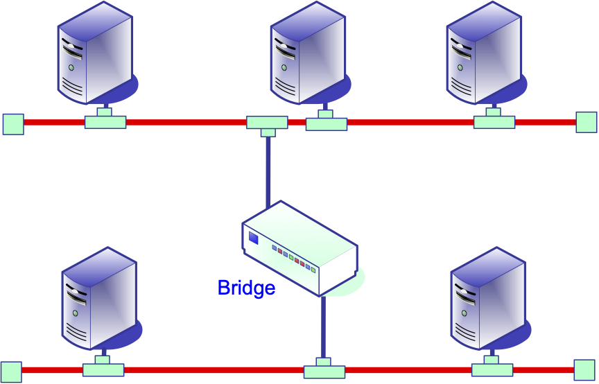

<!--
author:   Alexander A Kist

email:    kist@ieee.org

version:  1.2.2

language: en

narrator: Australian Female

mode:     Textbook

date:     03/06/2025

comment:  This module covers local area networks and Ethernet.

icon:     ./img/icon.ico


-->

# Local Area Networks and Ethernet

 This module builds on *Networking Basics* and unpacks dominant technologies that provide connectivity between network nodes such as computers and other networked devices.
<br>
Using IEEE research papers (which can be assessed for free) you learn about how local area network technology has evolved to ground an understanding of operating principles of Ethernet networks.

> **Competency** - Competently use and explain terms and concepts that explain how local networks and Ethernet have developed to provide wired and wireless network connectivity.


We explore how devices are connected locally. In terms of the network models, this module discusses *Link Layer* technologies. If you are connected to the Internet, likely, you are also connected to a *Local Area Network* either using an _Ethernet_ cable or wirelessly using *WLAN*.

Whereas LAN implies networks in one location such as a home network or a corporate network, this classification no longer directly translates into the technology that is being used. Boundaries have become blurred as the same technology, in particular  Ethernet, is used across a wide range of networks including LANs, MANs and WANs.

> Ethernet cables connect devices like desktop computers, printers and phones to a switch in a local network. The switch manages data traffic between its ports. Each device on the network has a unique MAC address, which is used by the switch direct data frames to the correct endpoint. to direct data.

<div style="text-align: right"> *Version @version (@date)*</div>

Acknowledgment of Country
==========================

The University of Southern Queensland acknowledges the traditional custodians of the lands and waterways where the University is located.
<BR><BR>
Further, we acknowledge the cultural diversity of Aboriginal and Torres Strait Islander peoples and pay respect to Elders past, present and future.

## Ethernet Basics

Today Ethernet is the dominant link layer technology and is widely used in many application domains. When it was introduced, it was just one of many competing protocols. Over the years it has evolved from a coax cable-based system supporting data rates of 10Mbit, to “Fast Ethernet” at 100Mbit, to the now common Gigabit Ethernet at 1Gbit which is used in consumer devices, and 10G for establishing point-to-point links between network switches. In this section, we are looking at some of the concepts and terms around Ethernet.


###  Original Ethernet Paper
_15 minutes read_

 [Metcalfe and Boggs (1976)](#References) describe in this paper the original Ethernet. Of course, a great many developments have occurred in Ethernet since then, but at the time it was one of several competing systems. Read the first two pages up to "Design Principles" and skim through the rest. Note that many aspects of Ethernet have changed since this very first publication including frame format, addressing and data rate.

> * Note the state of the art at the time.

###  Ethernet History
_16 minutes video_

In this video, Bob Metcalfe talks about how he (and David Boggs) invented Ethernet.


!?[ComputerConversationBobMetcalfe](https://youtu.be/m_agCPNGOzU "Computing Conversations: Bob Metcalfe on the First Ethernet LAN.")

> * Why did he select a setup with one wire?
> * What is Manchester encoding? Why did they use it?
> * At what rate did Ethernet start at? How did they get to 100 Mbps?

## Standards and IEEE 802.3
_3 minutes read_

Ethernet refers to a family of networking technologies that are widely used for local and other networks. Over the years Ethernet has constantly evolved to increase its data rate and transmission distance. The IEEE 802.3 Standard is a set of specifications that define the Ethernet protocol. It covers physical layer aspects such as modulation, electrical signalling and cabling and data link layer aspects such as the frame format and medium access control.

***10BASE5*** and **10BASE2** are legacy standards that specified Ethernet using coax and the cheaper thin coax with a shorter reach respectively. Links are half-duplex and *CSMA/CD* is used for access control.


***10BASE-T*** is the original Ethernet standard that uses twisted pair cables and simpler connectors. It provides a data rate of 10 Mbps and uses baseband signalling.

***100BASE-TX*** provides a data rate of 100 Mbps and also uses twisted pair cables, but with a different encoding scheme called 8B/6T that allows for faster transmission.

***1000BASE-T*** or *Gigabit Ethernet* provides a data rate of 1 Gbps. It uses a more complex encoding scheme called 4D-PAM5 (4-dimensional Pulse Amplitude Modulation) to achieve higher data rates over longer distances.

10BASE-T, 100BASE-TX and 1000BASE-T links use full-duplex but for backwards compatibility support a half-duplex mode. 100BASE-TX introduces autonegotiation to allow devices to automatically choose a speed and duplex mode. If the other device does not support autonegotiation will default to half-duplex mode.

*** 10GBASE-T *** achieves a data rate of 10 Gbps over twisted pair cables. This standard no longer supports CSMA/CD or half-duplex operation. Other versions of the standard use optical fibre (10GBASE-R) or SONET-based optical fibre systems (10GBASE-W).

## Medium Access
_5 minutes activity_


A bus with a shared medium is the simplest topology to implement. One of the key issues for such a system is managing access to a shared medium.

!?[SharedMediumAccess](https://youtu.be/sO1ctZyBaAg "Collisions occurring with shared media access.")

> * Based on your current knowledge - how would you address this problem?
> * Note down your response before moving on.

###  The ALOHA System
_12 minutes read_

One of the first approaches to deal with this problem was developed in the 1970s by Norman Abramson at the University of Hawaii and it is named after the Hawaiian greeting "Aloha". The ALOHA protocol is a simple medium access control protocol for managing communication in a network with a shared transmission medium, such as a wireless or satellite network. The protocol is used to manage collisions if multiple users are accessing the channel simultaneously.

The basic idea behind the ALOHA protocol is that each user can transmit data packets whenever they have data to send, without any central coordination. When a user wants to transmit a packet, they send it out onto the channel. If the channel is free and no other user is transmitting at the same time, the packet is successfully transmitted. However, if two or more users transmit at the same time, a collision occurs, and the packets involved in the collision are lost.

](#References).")

Read the first page and the first column of the second page of [Abramson (1970)](#References).

> * What draw backs for binary data of traditional wired communication are identified by the author?
> * How does the nature of the date of interactive time-shared computer systems differ from voice signnals?


Skip over the second column on the second page. Continue in the middle of the first column on the third page _"Information to and from the MENEHUNE in THE ALOHA SYSTEM is transmitted..."_ and continue to the end of this page.

> * Describe the radom access method that has been implemented.
> * How are collisions detected in this context?


###  Analogy - Medium Access
_5 minutes activity_

Assume a meeting with several participants. If two or more people are talking at the same time nobody is understood. In real life, we generally can understand others even in a very noisy environment so the example is somewhat contrived. However, we recently had a situation where contention was causing issues in an online meeting as the Zoom algorithm interpreted multiple people talking over each other as noise and turned the microphone in the room off.

> * What system could be used that is fair (at least on average) and allows everybody to voice their opinion?
> * Extend the problem by this condition: Participants should be able to join and leave arbitrarily without disrupting the system.

###  CSMA/CD
_5 minutes read_

If systems use a common transmission media and transmit simultaneously, the data on the wire will become garbled. To avoid this the _Carrier Sense Multiple Access with Collision Detect_ (*CSMA/CD*) algorithm is used. Using the algorithm each device listens for the carrier signal to determine whether the medium is idle before transmitting. If multiple devices transmit data simultaneously and a collision occurs, the devices detect the collision. To ensure that other devices are aware of the collision, the transmitting units continue the transmission for 32 to 48 bits. The transmitting stations involved in the collision then wait for a time and, if the bus is free again, attempt to transmit again. To avoid synchronisations, both wait for a random time before retransmitting.

There is a tradeoff between waiting time, the likelihood of further collisions and throughput. A longer waiting time reduces the likelihood of a collision but reduces the throughput of the network. To address this CSMA/CD uses the *Truncated Binary Exponential Backoff* algorithm to determine the random waiting time for retransmission after a collision. The nodes involved in the collision, use the following algorithm:

* After a collision, choose a random integer value between 0 and 2^k - 1, where k is the number of collisions that have occurred so far. For the first collision, that is 0 or 1, for the second, it is either 0, 1, 2 or 3.
* The devices then multiply the random value by the slot time (the time it takes for a signal to propagate across the network medium) to determine the waiting time for retransmission.
* If the waiting time calculated exceeds the maximum waiting time of 2^10 slot times, it is not increased further to avoid long waiting times - it is truncated.
* After the waiting time has elapsed, the device retransmits the frame.

Truncated Binary Exponential Backoff helps to manage contention in CSMA/CD networks. As consequence, it is not possible to determine the worst-case transmission time. The time to transmit a frame can only be defined in terms of statistical likelihood. In the early days, this behaviour led to some controversies.


> CSMA/CD is used by legacy half-duplex shared Ethernet. Most modern interfaces use full-duplex connections and CSMA/CD is not used. Up to 1000Base-T, half-duplex operation is supported.


###  Original Ethernet Controversies
_for interest only_

After Ethernet started to become widely used, several controversies arose as to its capacity and performance in the presence of loading. One article addressing this issue is [Boggs, Mogul & Kent (1995)](#references).

Skim through this article, keeping in mind that since its publication many other developments have occurred (such as 10/100-BaseT Ethernet and switched Ethernets). Note in particular some enduring engineering design issues, as described in Section 2.2 “How Performance is Measured” and Section 4.3 “Problems with Certain Existing Implementations”.

> * What are your take aways?

###  Token Ring and Token LAN
_5 minutes read_

Both *Token Bus LAN* (IEEE 802.4 Standard) and *Token Ring LAN* (IEEE 802.5 Standard) are legacy technologies that have largely been replaced by Ethernet, the now defacto standard. Both technologies are briefly discussed here to provide a historical perspective.

Both protocols are distinct from Ethernet and are token-passing protocols as the name implies. This means that stations take turns in transmitting data. A token is passed between nodes and only the node that has the token is allowed to transmit. This is in contrast to CSMA/CD used by Ethernet where devices listen for the carrier signals before transmitting data. The token approach avoids collisions, the latter has to manage potential collisions.


For *Token Bus LAN* a token-passing algorithm is used to arbitrate access to the transmission bus. The token is passed from one workstation to another using a physical bus. Logically the network implements a ring that is determined by how the control token is passed. The advantage of this approach is that system has deterministic performance guarantees as the token as passed in a round-robin fashion. Even when all stations are transmitting, will get a slot within a known time. Challenges of this approach include how the logic ring is managed if nodes enter or leave the network.


*Token Ring LAN* was introduced by IBM in the 1980s and uses a physical ring. The ring is built by using point-to-point connections and a ring interface. The frames circulate within the ring. A station transmits its frame when it has the token, and removes the frame after circulation. In contrast to CSMA/CD, this system operates well under load. *EtherCAT* is an example of a current technology that implements similar mechanisms to use Ethernet for real-time applications in automation - see the section below about  Ethernet in the context of industrial applications.

###  Footnote - Wireless Challenges
_5 minutes activity_

The wireless channel poses additional challenges, some of which have been already mentioned in the context of the ALOHA protocol. The medium is less reliable as it is subject to interference from various sources. Higher frame errors are likely due to higher bit errors. Due to the nature of radio transmission, senders cannot reliably monitor the channel while transmitting. The unbound nature of the medium also leads to *hidden terminal* and *exposed terminal* problems. This means that data rate and throughput generally are lower than in comparable wired applications.

Hidden Terminal Problem
-----------------------

The *hidden terminal problem* refers to a situation where a transmitting station is not aware of the presence of other stations beyond its reach that can interfere with other nodes that are part of the communication.


The figure above visualises the *exposed terminal problem*. The blue circle indicates the transmission range of _Node A_ and the green circle indicates the transmission radius of _Node C_. _Node B_ is the receiver. Imagine that _Node A_ is transmitting. Since Node C is not within reach of _Node A_, it cannot determine that _Node B_ is currently busy receiving the transmission of _Node A_. If _Node C_ transmits now, both signals will interfere with each other at _Node B_. _Node B_ will be unable to receive either transmission.

Exposed Terminal Problem
------------------------
The figure below visualises this problem. _Node A_ and _Node D_ are receiving stations, _Nodes B_ and _C_ are transmitting. The circles indicate their transmission range.


> * Looking at the figure and the transmissions, how could a terminal be exposed in this context?
> * Note down you answer before moving on.

Imagine that _Node B_ is currently transmitting to _Node A_, shown by the blue circle. _Node C_ can hear _Node B_  so it does not transmit. However, _Node C_ could transmit to _Node D_, shown by the green circle without interfering with _Node A_.

> Both examples show that just listing to a silent channel does not work in this case. How could this problem be overcome?
> Note down your answer before reading on. The next section explains how Wi-Fi addresses these challenges.


###  CSMA/CA
_10 minutes read_

Much of the content above, while still relevant, has discussed legacy technology. Here were are looking at CSMA/CA (Carrier Sense Multiple Access, Collision Avoidance), an algorithm that is employed by Wi-Fi when accessing the air medium to avoid contention. The wireless medium, i.e. using radio frequency transmission, is by its nature unbound and shared.

> * In regard to shared media access, what is the main difference when managing contention?
> * Hint - CD does not work in a wireless environment.
> * Note down your answer before you move on.

Radio interfaces are not able to detect collisions over the air, as a wireless radio cannot receive and transmit at the same time. Therefore an algorithm is needed that implements *collision avoidance* instead of _collision detection_. Network access needs to be randomised across multiple stations.

Two modes to manage operation are supported, the ***Point Coordination Function*** (PCF) which implements a centralised approach, and the ***Distributed Coordination Function*** (DCF) which as suggested by its name the distributed control approach.

The former, PCF, is not widely used but is useful for infrastructure networks. In this case, the access point grants access by polling stations.

The DCF function is mandatory and is based on *Carrier Sense Multiple Access with Collision Avoidance* (CSMA/CA) where stations content for access. Stations wait for a free channel and the first transmission seizes the channel. It uses random back-off for busy channels and may use CA through Request to Send/Clear to Send (RTS/CTS). While CA overcomes the hidden terminal problem it is not used in practice.

The timing is used to implement different priorities for the algorithm. Functions with the highest priority seize the channel before transmissions with lower priorities. The figure below depicts these intervals graphically. The x-axis shows the time and two consecutive frames are depicted.


***Interframe Spacing*** (IFS) is used to reduce the probability of collision. It identifies the back-off or waiting time before a retransmission is reattempted.

* *** Short Interframe Space (SIFS) *** is used for high-priority transmissions such as RTS/CTS and positive ACKs. Priority transmissions can begin once SIFS has elapsed.
* *** PCF Interframe Space *** (PIFS) is used by PCF during contention-free operation. Stations transmit after PIFS has elapsed and by its timing it preempts contention-based traffic.
* *** DCF Interframe Space (DIFS) *** is the minimum idle time for contention-based traffic. Stations transmit after they detect a DIFS-free period.
* *** Extended Interframe Space *** (EIFS) is not fixed and is used in case of errors in the frame transmission.


Contention-Based Access Using DCF
---------------------------------
Contention-based access is implemented using the following algorithm.

* A frame is ready to be transmitted (received from the upper layer).
* Rund the BACKOFF procedure below.
* Transmit the frame.
* Wait for an acknowledgement. If the acknowledgement is received, the frame has been successfully transmitted.
* If a timeout occurs restart this procedure with the BACKOFF

BACKOFF

* If triggered by a timeout, double the contention window (in slots)
* Wait until the channel is idle for more than the DIFS
* In addition, add a random waiting time between [1, contention window] slots
* Decrement the contention window when the channel is idle
* Return to the calling algorithm when the contention window is 0.


> Further down, Wi-Fi networks are discissed in more detail.

## Bridging and Switching

Modern Ethernet looks very different from its original coax cable-based origins. Much of this has been possible through the introduction of switches. The section unpacks this evolution.

###  Evolution of Switching
_10 minutes read_

> You might come across there terms of *repeater*, *hub*, *bridge* and *switch* in the context of lengthy systems or specifying new systems. Therefore it is good to have a working understanding of what the devices do.


The figure depicts an original Ethernet setup using coax cabling. The cable runs from interface to interface, and endpoints are terminated. Damage to the wire or faulty connectors could affect the whole segment. Standing waves that were caused by defective devices were challenging to debug. All nodes shared the bandwidth, and all nodes saw all traffic. The cable length was limited to 500m.


*Repeaters* were introduced to extend the reach. The figure above depicts an example of a repeater that joins two segments. Repeaters separate segments, so one faulty segment does not impact on others. If collisions are detected, a jam signal is transmitted on all ports. Repeaters have no intelligence and simply retransmit the received signal. Therefore segments have to be the same speed. The use of repeaters enables star-type topologies, and the advantages of this led to the development of multiport repeaters: hubs.

Ethernet on Unshielded Twist Pair was developed to overcome the limitation of coax-based cabling. It implements Point-to-Point links and includes termination on the interface. A *hub* is required to configure networks with more than two computers. The maximum cable length is 100m. This design allows for smaller network interfaces and more fault-tolerant systems. However, the security and bandwidth limitations of the original system remain. The figure below depicts a hub connecting a coax-based network segment with several systems connected using unshielded twisted pair cabling.


The next step in the evolution of Ethernet networks were *bridges*, essentially intelligent *repeaters*. Bridges only forward frames that are well formatted, isolating collisions and packet errors. Bridges learn the location of devices and forward packets only to the required segment. Bridges need buffers to learn and store MAC addresses to achieve this. They are full-duplex and allow for different speed network segments. They also overcome the total segment limitations of earlier installations. The figure below depicts two network segments that are connected by a bridge.



Loops can be introduced if multiple bridges are connected to the same segments, and this situation is depicted in the figure below. Modern bridges use a spanning tree algorithm to overcome this issue. A Spanning Tree Protocol builds loop-free topologies by sending BPDUs (Bridge Protocol Data Units) and pruning all unnecessary links. Radia Perlman initially proposed this mechanism, and she has written several textbooks on networking subjects. Periodic updates ensure that topology changes (e.g. failures) are detected.


A switch is a bridge with multiple ports. Modern Ethernet networks rely exclusively on *switches* as they provide better isolation of devices, full-duplex communication, no chaining limits and fewer collisions. Mixed device speeds are allowed on the same switch. As not all traffic is broadcast to all ports, the devices also offer limited (superficial) privacy. An example of a setup using a switch is depicted in the figure below.


> Today *managed switches* are common as they provide features and functionality for network administrators to control traffic flows in the network. Managed switches offer a range of configuration options to set up *Virtual LANs*, prioritise traffic, set up link aggregation, and monitor network performance. Managed switches often include security features such as MAC address filtering and port security. This limits the devices connected to a network port to prevent unauthorised access. For example, a port can learn the *MAC address* of the device that is connected to the network, and the port is turned off if a device with another MAC is connected.


###  GNS3 Example
_6 minutes video_

!?[DifferenceBetweenAHubAndASwitch](https://youtu.be/snD_X_6WZ0Q "The difference between a hub and a switch.")

###  Bridging and Switching

What is the primary function of a repeater in a network?

[[X]] To amplify the signal
[[ ]] To connect multiple devices
[[ ]] To provide advanced network features

Which of the following network devices operates at the physical layer of the OSI model?

[[X]] Hub
[[ ]] Switch
[[ ]] Managed switch

What are the main differences between a hub and a switch?

[[X]] A hub operates at the physical layer, while a switch principally operates at the data link layer
[[X]] A hub broadcasts data to all connected devices, while a switch forwards data only to the intended recipient
[[ ]] A hub can prioritize traffic based on QoS, while a switch cannot

What is a managed switch?

[[X]] A type of switch that provides functionality to control and optimize traffic flow.
[[ ]] Another name for a hub that allows for link aggregation and QoS prioritization.
[[ ]] An alternative name for a repeater that amplifies signal for better transmission.

## Frame Format and Addressing
_5 minutes read_


Data that is transmitted over Ethernet is split into chunks called frames and the figure above shows the frame format. The specific fields of an Ethernet frame and their sizes are:

* destination address, 48 bits
* source address, 48 bits
* type field, 16 bits, identifying the playload, for example as an IP datagram, Address Resolution Protocol (ARP) request/reply
* data, the variable payload of 46-1500 bytes
* CRC, a32 bit cyclic redundancy check

The minimum frame size is 64 bytes so for smaller frames padding is added. Each system's *network interface* also known as NIC (*Network Interface Card*) has a unique address, called ***Ethernet address***, ***hardware address***, ***physical address*** or ***MAC address***. While the address is hardcoded into the firmware ROM of the network card, for many modern devices it can be changed in software. The 48-bit address is usually written as six, 8-bit hexadecimal numbers, e.g. 64:66:B3:FF:11:20.

Each frame contains a source and destination address. In operation, the interface listens for frames addressed to it. If the frame destination address does not match the local address the frame is dropped. The exception to this is broadcast frames that contain the address of all ones (FF:FF:FF:FF:FF:FF). These frames are used by the *Address Resolution Protocol* (ARP) which is covered in the following module. The network interface can also be set to pass all frames through and ignore the address filtering mechanism. This is called the *promiscuous mode* and is used to analyse traffic using packet sniffers such as *Wireshark*.


###  Wireshark Example
_15 minutes activity_

We have introduced Wireshark previously, here it is used as a tool to analyse Ethernet frames.

!?[WiresharkEthernetFrame](https://youtu.be/V_yKyNPDBY8 "Decoding an Ethernet frame using Wireshark.")

> Do the same activity at home. Open Wireshark and capture some traffic on your network.
>
> * How can Ethernet fields be identified?
> * Select individual fields and locate their position in the block of “raw bytes”.

###  Manually Decoding a Frame
_3 minutes video_

When debugging information, you might be in a situation where you need to debug an Ethernet frame manually. If you know the protocol fields, that is straightforward.

!?[DecodingAFrame](https://youtu.be/brvhNyDCmWM "Manually decoding an Ethernet frame.")

###  Decode an Ethernet Frame
_15 minutes activity_

The raw data of an Ethernet frame is depicted below. Byte offset, raw bytes and ASCII decode of the raw bytes are shown.

```
0000    00 16 d3 12 2b 14 00 21 9b 40 fc f3 08 00 45 00    ....+..! .@....E.
0010    00 3a 65 c3 40 00 80 06 fb 9d 8b 56 41 6a 8b 56    .:e.@... ...VAj.V
0020    41 46 17 3e 08 b8 d0 71 7b 38 e5 d1 d5 af 50 18    AF.>...q {8....P.
0030    fd 6f 99 89 00 00 00 24 80 7c fe ff 00 00 00 00    .o.....$ .|......
0040    00 00 94 e9 d1 00 51 8c                            ......Q.
```

* What are the MAC source and destination addresses?
* What is the payload type?
* What is the OUI(Organizational Unique Identifier)? Who are the card vendors?
* How large is the frame?

For Ethernet codes see https://regauth.standards.ieee.org/standards-ra-web/pub/view.html.

## Wireless LAN

Wireless local network access has become the norm for home networks as well as corporate networks. Wireless Local Area Networks (WLANs) have been standardised by the IEEE LAN/MAN standards committee as the IEEE 802.11 family of standards.

> *Wi-Fi* is a brand of the [_WiFi Alliance_](http://www.wi-fi.org). Often the term is used to refer to WLANs and related equipment in general.

Using the wireless medium for network access poses some additional challenges. The wireless channel is less reliable as it is subject to interference. Generally, data rate and throughput are lower in wireless environments using technology of the same level of maturity. Higher bit error rates on the transmission channel cause more frame errors. Clients cannot reliably monitor the channel while transmitting and power consumption of mobile clients is also a concern. As the channel is public it is open to eavesdropping and other security attacks.

As discussed earlier, CSMA/CD does not work in a wireless environment for several reasons; most notably because stations cannot transmit and listen at the same time. The _hidden terminal_ and the *exposed terminal problems* also need to be considered. To overcome these problems two MAC layer mechanisms are employed to use the available medium effectively and to avoid collisions: the *Distributed Coordination Function* (DCF) and the *Point Coordination Function* (PCF).

###  Wireless Ethernet
_for interest only_

This article provides a historical perspective. For an overview of the developments at the time, read the first three pages of [Heegard et al. (2001)](#references).

> * What are the main IEEE standards which define wireless Ethernet?
> * What are the principal data rates?
> * What challenges are present in wireless Ethernet that are not present in wired Ethernet?

###  Wardriving and Piggybacking

*** Piggybacking ***  refers to the practice of using somebody else's (open) WLAN connection (without their knowledge).

*** Wardriving ***  is an activity where hobbyists drive through neighbourhoods and look for open wireless networks to log the information. It is named after *Wardialing* coined by 1983 film [WarGames](https://www.imdb.com/title/tt0086567/). Databases are available that identify open locations, for example, http://wigle.net/.

> Obviously, there are potential legal implications for both activities.

###  In Practice -- WLAN Security
_20 minutes activity_

> * Do some quick background research to find out what these acronyms means WPAv2, WPA-PSK, WEB and SSID.

There are resources available online that discuss WLAN security. For example, the [WA Police Force](https://www.police.wa.gov.au/Crime/Technology-crime/Secure-your-wireless-network), the [American Cybersecurity & Infrastructure Security Agency](https://www.cisa.gov/news-events/news/securing-wireless-networks) or, focusing on large organisations, these resources by the [Australian Cyber Security Centre](https://www.cyber.gov.au/resources-business-and-government/essential-cyber-security/ism/cyber-security-guidelines/guidelines-networking). Spend about 10 minutes researching the following questions.

> * What are current best practice recommendations for wireless network encryption and authentication schemes?
> * If you use a wireless network at home, university or work, what schemes are the networks using? Is it using the the most secure options?
> * Do you beliew network security is important?


###  CSIRO WLAN Patent
_4 minutes read_

The Australian _Commonwealth Scientific and Industrial Research Organization_(CSIRO) has a 1996 US patent [(5,487,069)](https://patents.google.com/patent/US5487069A/en) that covers

> ''a wireless LAN, a peer-to-peer wireless LAN, a wireless transceiver and a method of transmitting data, all of which are capable of operating at frequencies in excess of 10 GHz and in multipath transmission environments.''

Specifically, it addresses

> ''a combination of techniques which enable adequate performance in the presence of multipath transmission paths where the reciprocal of the information bit rate of the transmission is short relative to the time delay differences between significant ones of the multipath transmission paths. In the LANs the mobile transceivers are each connected to, and powered by, a corresponding portable electronic device with computational ability.''

This applies directly to the current 802.11 standards. For years the CSIRO has fought legal battles with some of the world's biggest technology companies, including Microsoft Corp., Intel Corp., Apple, Dell Inc., Hewlett-Packard Co. and Netgear Inc. In April 2009 the CSIRI settled with the 14 companies that were involved.

Read [this article](http://theconversation.com/patently-australian-csiro-settles-suits-over-wi-fi-6184) that talks about another settlement.

> * Which products use the CSIRO invention?
> * The CSIRO has licence agreements with most of the major companies. How much of the market share does this cover?


###  Wifi Could be Much More
_15 minutes reading_

Read the introduction of [Sun et al.(2014)](#references).

> * Note how the sub standarts have involved.
> * Which advance allowed an increase of wifi throughput for earlier systems, e.g. 802.11n and below? Briefly explain two examples.
> * What three areas of focus for improvements and what are the key drivers for each?

Read one additional major section of the article, such as "Long-Range Extensions".

> * Pick one of the upcoming WiFi technologies and briefly explain its feature and how they are achieved.


## Ethernet Evolution
_10 minutes activity_


Ethernet is continuously evolving. Some important modern features are listed below.

***Virtual LANs (VLANs)*** are logical partitions within a single physical network. VLANs are set up to isolate traffic, manage security and improve network management. Devices can be grouped regardless of their physical location or attachment to the LAN. Criteria such as the port, the MAC address or protocols can be used to assign a virtual LAN.

***Power over Ethernet*** or *PoE* refers to a system that powers devices using twisted pair Ethernet cabling. In this case, a single cable provides both, a data connection and power to operate the connected device such as *VoIP* phones and *IP cameras*.

***Energy Efficient Ethernet***,  *EEE* or *Green Ethernet* reduces switch power consumption during low network traffic periods. It is defined in Standard IEEE802.3az.

> * Do a brief background search about each feature and note down key drivers.

## Ethernet in Industrial Applications

Given the prevalence of Ethernet, it is natural that it is also being used in the context of industial automation. This section explores two applications.

###  Industrial Ethernet
_10 minutes read_

[Rojas & Morell (2010)](#references) is a conference paper that is based on a Cisco White Paper. It covers several topics that have been previously discussed.

Read the introduction, skim over the following sections and continue reading with "What is Industrial Ethernet" to answer the questions. The remaining sections are for interest.

> * What is Industrial Ethernet?
> * What are the benefits of a switched Ethernet Architecture?
> * What qualities are required from an intelligent Industrial Ethernet solution?


###  Distributed Real-Time Control
_20 minutes read_

Read the introduction of this article by [Cena et al.(2013)](#references).

> * What alternative technologies exist for real-time control systems and how do they relate to distributed clock synchronisation?

Then move on to this [blog post](https://dewesoft.com/blog/what-is-ethercat-protocol). It provides an introduction to EtherCAT. Spend about 10 minutes on this task. Hint, you might want to jump to "Why EtherCAT".

> * How does EtherCAT work?

## Other Data Link Layer Technologies

In this section, you have the opportunity to contrast performance parameters, applications and use of other link layer technologies such as Bluetooth, WiMax and ZigBee.

###  ZigBee
_5 minutes read_

Read the first page of [Geer (2005)](#references).

> * What are four properties required in inexpensive, low-power networks?
> * What IEEE standard is ZigBee built on?
> * How are routes between devices discovered?
> * What applications come to minde?

###  Bluetooth
_15 minutes read_

Read pages 90 to 93 of [Sairam, Gunasekaran & Redd (2002)](#references). Stop at "Logical Link Control and Adaptation Protocol."

> * What frequency band is used?
> * What maximum date rate of Bluetooth is mentioned?
> * What term is given to Bluetooth networks and what topologies do they use?

###  WiMax
_10 minutes read_

Read pages 31 and 32 of [Etmad (2008)](#references).

> * What is OFDMA?
> * On what IEEE standard is WiMax based?
> * Do a quick web search to see if WiMax is available in your area?


## References

Abramson, N. (1970). [THE ALOHA SYSTEM: another alternative for computer communications](https://dl.acm.org/doi/10.1145/1478462.1478502). Paper presented at the Proceedings of the November 17-19, 1970, fall joint computer conference, Houston, Texas.

Boggs, D. R., Mogul, J. C., & Kent, C. A. (1995). [Measured capacity of an Ethernet: myths and reality](https://dl.acm.org/doi/10.1145/52324.52347). _SIGCOMM Comput. Commun. Rev., 25_(1), 123-136.

Cena, G., Bertolotti, I. C., Scanzio, S., Valenzano, A., & Zunino, C. (2013). [Synchronize Your Watches: Part II: Special-Purpose Solutions for Distributed Real-Time Control](https://ieeexplore-ieee-org.ezproxy.usq.edu.au/document/6532473/). _IEEE Industrial Electronics Magazine, 7_(2), 27-39.

Etemad, K. (2008). [Overview of mobile WiMAX technology and evolution](https://ieeexplore-ieee-org.ezproxy.usq.edu.au/document/4644117/). _IEEE Communications Magazine, 46_(10), 31-40.

Geer, D. (2005). [Users make a Beeline for ZigBee sensor technology](https://ieeexplore-ieee-org.ezproxy.usq.edu.au/document/1556477). _Computer, 38_(12), 16-19.

Heegard, C., Coffey, J. T., Gummadi, S., Murphy, P. A., Provencio, R., Rossin, E. J., . . . Shoemake, M. B. (2001). [High performance wireless Ethernet](https://ieeexplore-ieee-org.ezproxy.usq.edu.au/document/965361/). _IEEE Communications Magazine 39_,(11), 64-73.

Metcalfe, R. M., & Boggs, D. R. (1976). [Ethernet: distributed packet switching for local computer networks.](https://dl-acm-org.ezproxy.usq.edu.au/doi/abs/10.1145/360248.360253) Commun. ACM, 19(7), 395-404.

Rojas, C., & Morell, P. (2010). [Guidelines for Industrial Ethernet infrastructure implementation: A control engineer's guide](https://ieeexplore-ieee-org.ezproxy.usq.edu.au/document/5469772/). In _2010 IEEE-IAS/PCA 52nd Cement Industry Technical Conference_ (pp. 1-18). IEEE.

Sairam, K. V. S. S. S. S., Gunasekaran, N., & Redd, S. R. (2002). [Bluetooth in wireless communication](https://ieeexplore-ieee-org.ezproxy.usq.edu.au/document/1007414/). _IEEE Communications Magazine, 40_(6), 90-96.

Sun, W., Lee, O., Shin, Y., Kim, S., Yang, C., Kim, H., & Choi, S. (2014). [Wi-Fi could be much more](https://ieeexplore-ieee-org.ezproxy.usq.edu.au/document/6957139/). _IEEE Communications Magazine, 52_(11), 22-29.

Yu-Ju, L., Latchman, H. A., Newman, R. E., & Katar, S. (2003). [A comparative performance study of wireless and power line networks](https://ieeexplore-ieee-org.ezproxy.usq.edu.au/document/1193975/). _IEEE Communications Magazine, 41_(4), 54-63.


